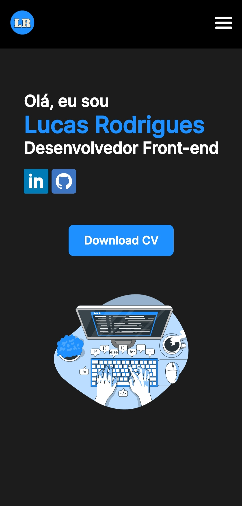
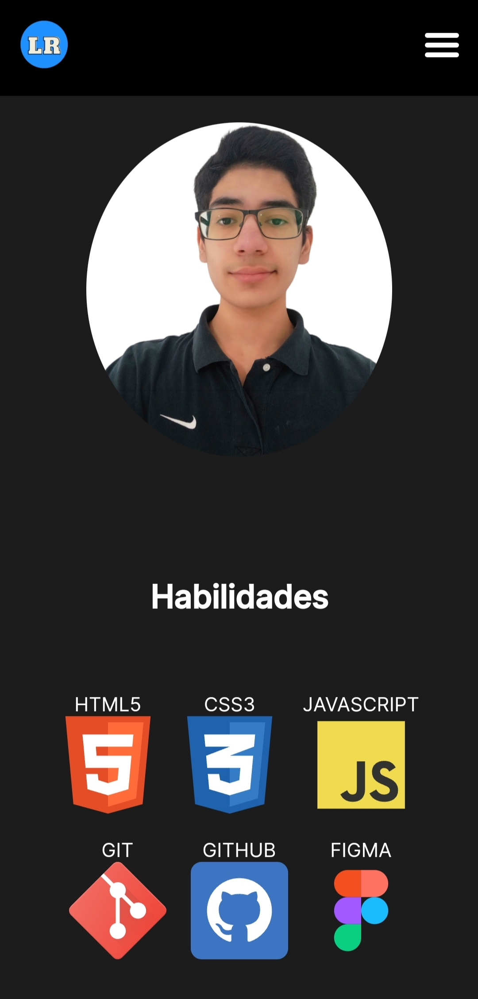
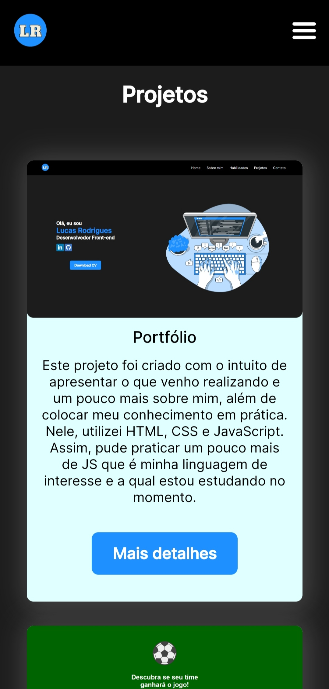
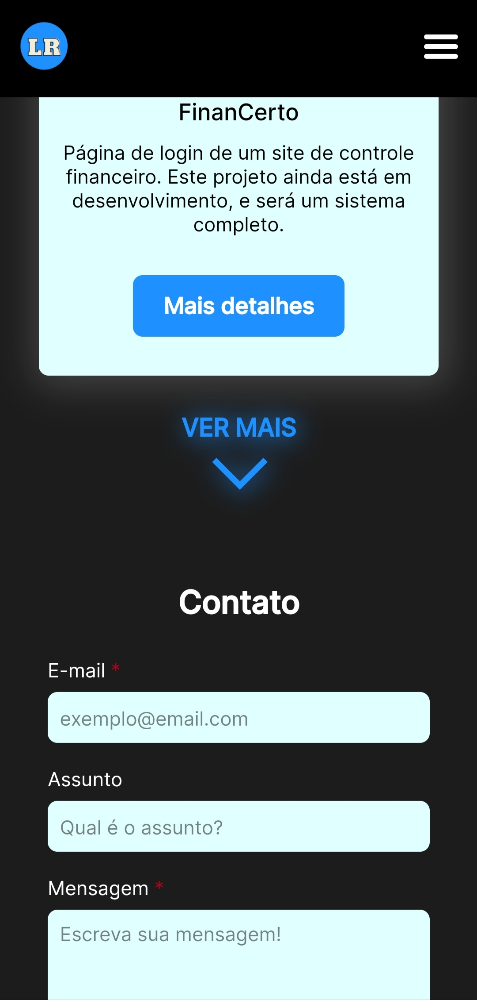
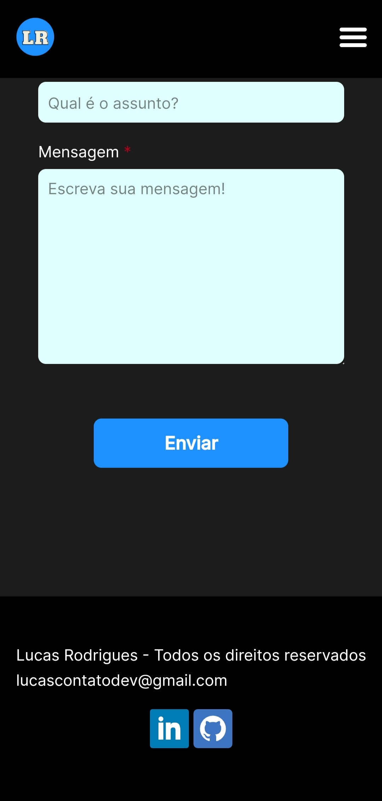
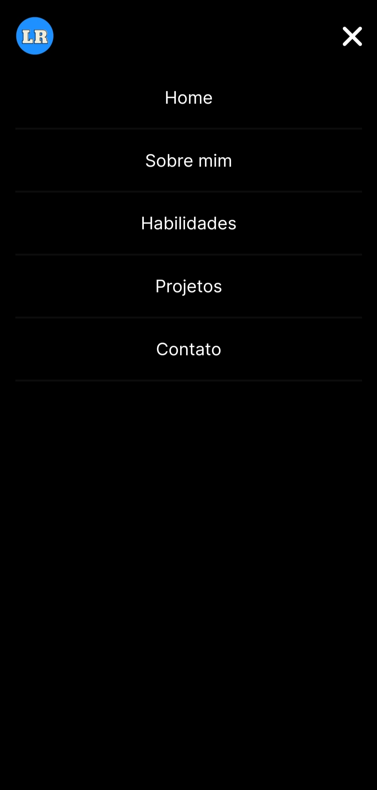

# Portfólio
 

# Sobre o projeto

[Clique aqui para acessar o projeto](https://portfolio-lucasrodrigues.netlify.app/)

Este projeto foi criado com o intuito de apresentar o que venho realizando e um pouco mais sobre mim, além de colocar meu conhecimento em prática durante o desenvolvimento e aprender coisas novas.

## Layout mobile

         
  

## Layout web

# Tecnologias utilizadas

- HTML5
- CSS3
- JavaScript
- Figma
- GIT
- GitHub

## Implantação em produção
- Front end web: Netlify

# Autor

- Lucas Rodrigues Souza
- [LinkedIn](https://www.linkedin.com/in/lucas-rodrigues-perfil/)
