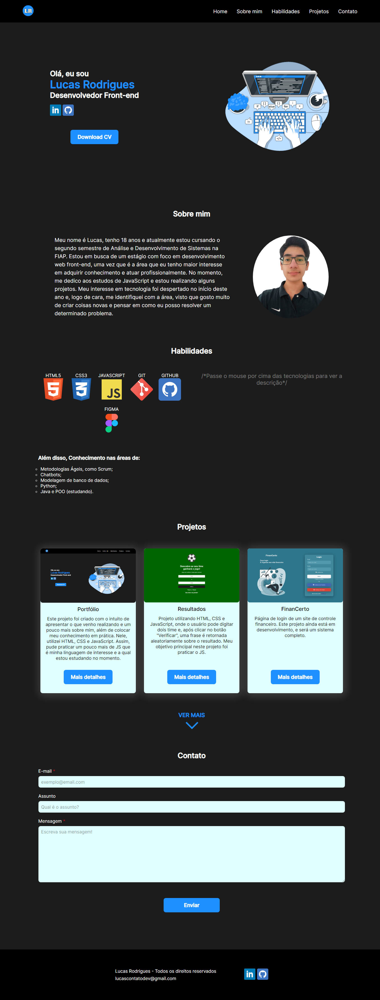

<h1 align= "center" > Portfólio </h1>

  
  
  

## Sobre

✔ Meu Portfólio. Aplicação criada para apresentar meus projetos e um pouco mais sobre mim!  
✔ Projeto responsivo

## Deploy

https://portfolio-lucasrodrigues.netlify.app/

 

## Ultimas autalizações

- Criação do botão ver mais/menos e adicionado mais projetos que realizei!
